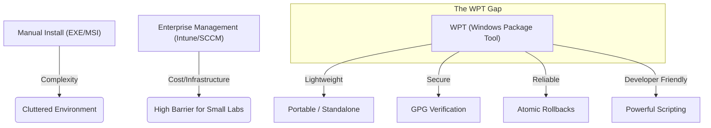

# WPT Value Proposition

This document explains the specific gap that the Windows Package Tool (WPT) fills in the Windows ecosystem.

## The Bridge to Modern Packaging

WPT fills the critical gap between heavy enterprise solutions and unmanaged, manual installations.

## Why WPT?

| Feature | Windows Default | WPT Solution |
| :--- | :--- | :--- |
| **Interface** | GUI Wizards (Manual) | **Unified CLI** (`wpt install`) |
| **Security** | None (Untrusted binaries) | **GPG Signature Verification** |
| **Stability** | Partial Uninstall / Leaks | **Atomic Cleanup & Rollback** |
| **Control** | Static Installers | **Rich Maintainer Scripts** (PS/Py) |
| **Size** | Large Installers | **Lightweight Packages** (.tar.gz) |

## Key Concepts

- 📦 **Atomic**: If something fails, the system returns to the previous state naturally.
- 🛡️ **Secure**: Native GPG signature verification for custom repositories.
- 🚀 **Lightweight**: No heavy databases or permanent background services.
