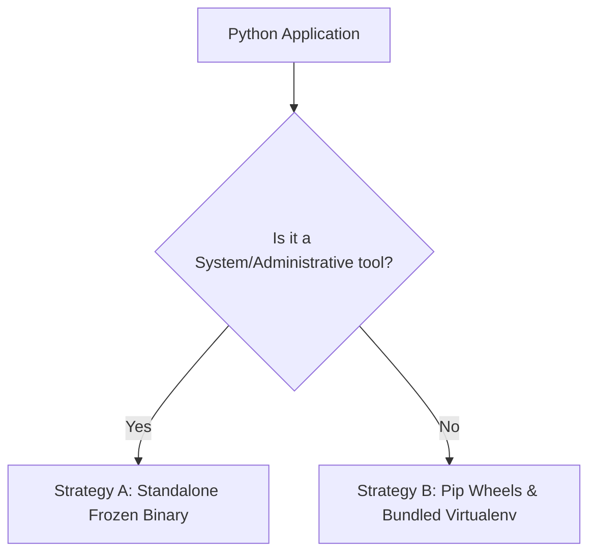

# How to Package Python Applications

This guide describes how to bundle and distribute Python-based applications and tools cleanly using the Windows Package Tool (WPT).

Python packaging on Windows presents unique challenges, such as runtime dependencies, environment variables (`%PYTHONPATH%`), and potential conflict with system-level Python installations. This guide provides robust patterns to ensure your packaged Python application runs reliably under administrative contexts.

---

## 1. Choose a Packaging Strategy

Depending on the nature of your application, choose one of the two primary strategies:



### Strategy A: Standalone Frozen Binary (Recommended)

This approach compiles the application along with a dedicated, isolated Python interpreter and all dependency DLLs into a standalone directory using tools like `cx_Freeze` or `PyInstaller`.

* **Best for**: Core system agents, administrative utilities, high-privilege services, or offline environments.
* **Pros**: Zero runtime dependencies on the target workstation; isolated from user-space Python path changes; highly reliable.
* **Cons**: Larger package size (typically 20MB - 40MB).

### Strategy B: Bundled Wheels & Virtual Environment

This approach distributes pure Python source or wheels and builds a local Python Virtual Environment (`venv`) on the host system during the installation phase.

* **Best for**: Lightweight scripts, developer tools, or internal applications where package size is critical.
* **Pros**: Extremely small package size (under 2MB).
* **Cons**: Requires Python to be pre-installed on the host system (or as a WPT package dependency); installation takes longer due to runtime pip assembly.

---

## 2. Strategy A: Step-by-Step (Standalone Frozen Binary)

### Step 1: Compile the Application

Use `cx_Freeze` or `PyInstaller` on a Windows build machine to freeze your app.

For example, using `cx_Freeze` in a standard `setup.py`:

```python
from cx_Freeze import setup, Executable

setup(
    name="my-app",
    version="1.0.0",
    options={
        "build_exe": {
            "packages": ["os", "sys", "requests", "cryptography"],
            "excludes": ["tkinter", "unittest"]
        }
    },
    executables=[Executable("my_app/__main__.py", target_name="my-app.exe", base="Console")]
)
```

Run `python setup.py build_exe` to generate the compiled folder under `build/exe.win-amd64-3.x/`.

### Step 2: Set Up WPT Structure

Create your package workspace and place the compiled files under a `data/` folder:

```text
my-app-package/
├── pms/
│   ├── metadata.json
│   ├── install.py
│   └── remove.py
└── data/ (Copy the entire cx_Freeze output folder here)
    ├── my-app.exe
    ├── python3.dll
    ├── lib/
    └── ...
```

### Step 3: Define Metadata (`pms/metadata.json`)

```json
{
  "name": "my-app",
  "version": "1.0.0",
  "description": "My Standalone Python Utility",
  "maintainer": "Maintainer <maintainer@example.com>",
  "specification": "1.0.0",
  "homepage": "https://example.com"
}
```

### Step 4: Write the Installer Script (`pms/install.py`)

To make the application executable from any Command Prompt or PowerShell terminal without polluting the system-wide `%PATH%` variable, register it using native **Windows App Paths**.

```python
import os
import sys

def main():
    install_dir = os.environ.get('WPT_INSTALL_DIR')
    if not install_dir:
        print("Error: WPT_INSTALL_DIR is not set.", file=sys.stderr)
        sys.exit(1)

    exe_path = os.path.join(install_dir, "my-app.exe")
    if not os.path.isfile(exe_path):
        print(f"Error: my-app.exe not found at {exe_path}", file=sys.stderr)
        sys.exit(1)

    # Windows-specific Registry Integration
    if sys.platform == 'win32':
        import winreg
        try:
            # HKLM App Paths enables global execution without polluting %PATH%
            app_paths_key = r"SOFTWARE\Microsoft\Windows\CurrentVersion\App Paths\my-app.exe"
            with winreg.CreateKey(winreg.HKEY_LOCAL_MACHINE, app_paths_key) as key:
                winreg.SetValueEx(key, "", 0, winreg.REG_SZ, exe_path)
                winreg.SetValueEx(key, "Path", 0, winreg.REG_SZ, install_dir)
            print("Successfully registered my-app.exe in App Paths.")
        except Exception as e:
            print(f"Error writing Registry App Paths: {e}", file=sys.stderr)
            sys.exit(1)
            
    sys.exit(0)

if __name__ == '__main__':
    main()
```

### Step 5: Write the Uninstaller Script (`pms/remove.py`)

Ensure your package purges registry handles cleanly when uninstalled.

```python
import sys

def main():
    if sys.platform == 'win32':
        import winreg
        try:
            app_paths_key = r"SOFTWARE\Microsoft\Windows\CurrentVersion\App Paths"
            with winreg.OpenKey(winreg.HKEY_LOCAL_MACHINE, app_paths_key, 0, winreg.KEY_ALL_ACCESS) as key:
                try:
                    winreg.DeleteKey(key, "my-app.exe")
                    print("Successfully removed my-app.exe from App Paths.")
                except OSError:
                    print("my-app.exe was not registered in App Paths (or already removed).")
        except Exception as e:
            print(f"Error cleaning Registry App Paths: {e}", file=sys.stderr)
            sys.exit(1)
            
    sys.exit(0)

if __name__ == '__main__':
    main()
```

### Step 6: Build the Package

Run the following build command pointing to your package workspace:

```bash
wpt build my-app-package/
```

This generates the ready-to-distribute package: `my-app_1.0.0_x64.tar.gz`.

---

## 3. Strategy B: Step-by-Step (Pip Wheels & Virtualenv)

If your app must remain small, bundle all wheel dependencies within the package to ensure the installation is **deterministic** and **offline-capable**.

### Step 1: Pre-download dependency wheels

On a system matching the target environment, download all required wheels locally:

```bash
pip download -d package-workspace/data/wheels/ -r requirements.txt
# Download your application wheel too
pip wheel -w package-workspace/data/wheels/ .
```

### Step 2: Set Up WPT Structure

```text
my-app-package/
├── pms/
│   ├── metadata.json (Specify dependency on 'python')
│   ├── install.py
│   └── remove.py
└── data/
    └── wheels/
        ├── my_app-1.0.0-py3-none-any.whl
        ├── requests-2.31.0-py3-none-any.whl
        └── ...
```

### Step 3: Write the Installer Script (`pms/install.py`)

This script uses the system's global Python environment to build a dedicated virtual environment, ensuring isolation.

```python
import os
import sys
import subprocess

def main():
    install_dir = os.environ.get('WPT_INSTALL_DIR')
    wheels_dir = os.path.join(install_dir, "wheels")
    venv_dir = os.path.join(install_dir, "venv")
    
    # 1. Create isolated Virtual Environment
    print("[*] Creating isolated virtual environment...")
    subprocess.run([sys.executable, "-m", "venv", venv_dir], check=True)
    
    # Locate pip path inside the virtual environment
    pip_exe = os.path.join(venv_dir, "Scripts", "pip.exe") if sys.platform == 'win32' else os.path.join(venv_dir, "bin", "pip")
    
    # 2. Install wheels offline
    print("[*] Installing bundled wheels...")
    subprocess.run([
        pip_exe, "install", 
        "--no-index", 
        f"--find-links={wheels_dir}", 
        "my_app"
    ], check=True)
    
    # 3. Create a global command wrapper
    if sys.platform == 'win32':
        import winreg
        app_exe = os.path.join(venv_dir, "Scripts", "my-app.exe")
        app_paths_key = r"SOFTWARE\Microsoft\Windows\CurrentVersion\App Paths\my-app.exe"
        try:
            with winreg.CreateKey(winreg.HKEY_LOCAL_MACHINE, app_paths_key) as key:
                winreg.SetValueEx(key, "", 0, winreg.REG_SZ, app_exe)
                winreg.SetValueEx(key, "Path", 0, winreg.REG_SZ, os.path.dirname(app_exe))
            print("[+] Registered command in App Paths successfully.")
        except Exception as e:
            print(f"[!] Warning: Failed to register App Paths: {e}", file=sys.stderr)
            
    sys.exit(0)

if __name__ == '__main__':
    main()
```

---

## 4. Best Practices Checklist for Python Packages

> [!TIP]
> Always follow these guidelines to guarantee bulletproof administrative deployment:

* **Enforce Idempotency**: Ensure that running the `install.py` script multiple times does not duplicate virtualenv files or raise registry errors. If registry keys already exist, overwrite them quietly.
* **Offline-First**: Never let installation scripts attempt to contact PyPI or the internet during the installation phase. Target servers or enterprise workstations are frequently behind firewalls.
* **App Paths Registry Preference**: Never modify the workstation's global system `%PATH%` to make Python scripts globally executable. Use the `App Paths` registry keys instead—it avoids global shell path pollution and prevents runtime DLL side-loading vulnerability attacks.
* **Clean Up**: Always clean up temporary directories, intermediate compilation directories, and registry keys in `remove.py`.
